<!-- theme: uncover -->

### $\mathscr{ZKP} \quad\mathfrak{ZKP}$
## $\mathcal{ZKP}$
### What is it

Kurt Pan

05/21/23

---

# What is a *Proof/Argument*

> A proof is whatever convinces me. 

- *Statement* is `True`
- *Computation* is `Correct`

---

## Proof System
- specified by a PPT verification algorithm $\mathcal{V}$ 

-  真的假不了 （**Completeness**）
- 假的真不了 （**Soundness**）

---
## Mathematical Proofs = $\mathcal{NP}$ 

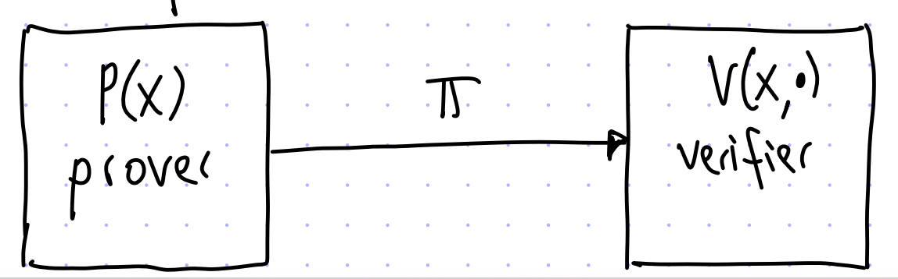

---
# What is *Knowledge*

---
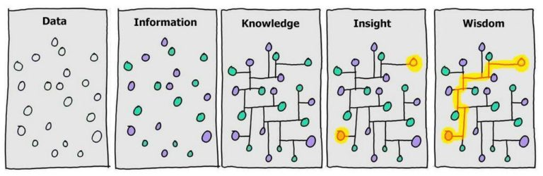

---
- **Data** is represented by a series of random dots that could mean something – or nothing. 
- **Information**, which is where meaning or relationship is applied to the raw material.  For the elimination of uncertainty.
- **Knowledge** is gained when we are *able* to memorise the information. As we gain knowledge we begin to make sense of things and draw connections between different pieces of information. However, it’s at the ‘Insight’ level where data becomes seriously useful. 
- **Wisdom** – the ability to use insight to facilitate informed decision making. 
- 从「大数据」到「人工智慧」必然要经过「零知识」时代

---

## R.I.P 陈皓！
> 有一个观点，数据是没有用的，只有把数据关联起来才有意义。**数据关联了以后，才叫信息**，我们不是做数据，我们是做信息。**信息里面找到因果关系，我们才能有知识**，比如说因为这个所以那个，这叫知识；有了知识以后，才能导出公式，我们才能通过公式去完成一些事情。所有做科学实验都是走这条路的，不断地做实验、拿数据，在数据里面把它标注好，关联起来，然后找信息，从信息里面找因果关系，从因果关系里看看能不能推出一些公式。大概就是这么一个逻辑。 

---

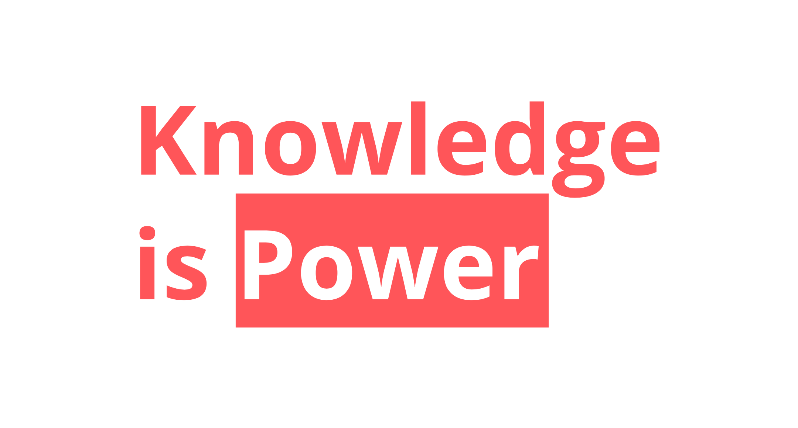

---
- 语言$\mathcal{L}$/关系$\mathcal{R}$
$x\in \mathcal{L}$

$C(\mathrm{x},w)=1$

witness $w$

---
# What is *Zere-Knowledge Proof*?

---
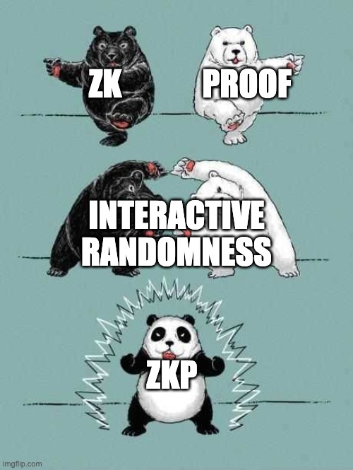

---

一个不增加任何计算能力（知识）
但却可以使我想信的东西（证明）

A proof that reveals no more *information* (or knowledge) than the validity of the statement it supports.

> 听君一席话，
> 如听一席话。

---
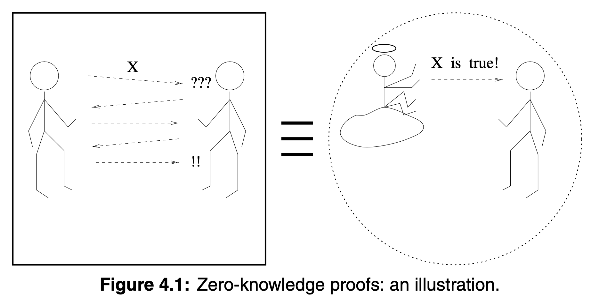

---
## Simulator
- $\left\langle P, V^*\right\rangle(x)$ (i.e., the output of the interactive machine $V^*$ after interacting with the interactive machine $P$ on common input $x$ )
- $S^*(x)$ (i.e., the output of machine $S^*$ on input $x$ )

---
> 潘老师认识到零知识证明和计算复杂性理论在密码学中的重要性并且知道我们在这方面可能会遇到问题。零知识证明可用来构造安全的密码认证协议，计算复杂性理论可用来评估密码难题的破解难度。那时候**复旦大学的朱洪老师是零知识证明的专家，潘老师便把他请来给我们作报告**。
--王小云

---
# What are *IP/MIP/PCP/IOP*

---
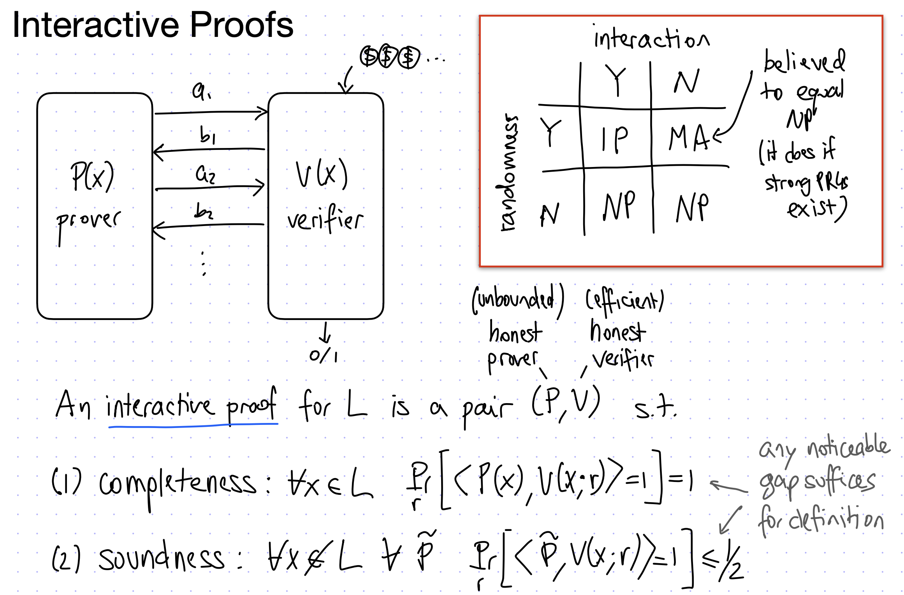

---
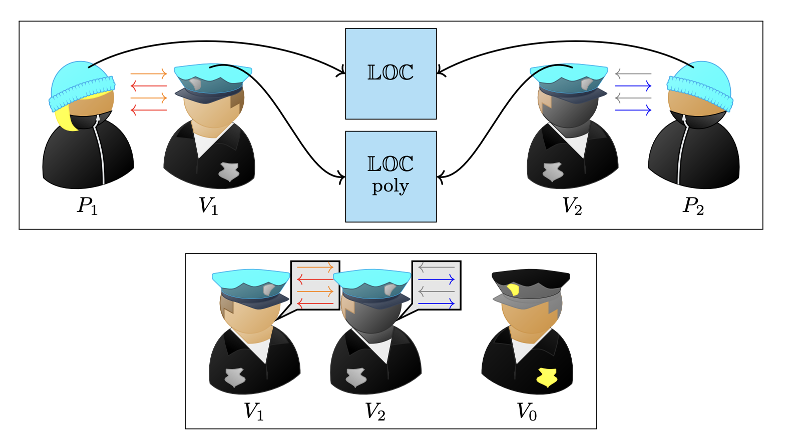

---

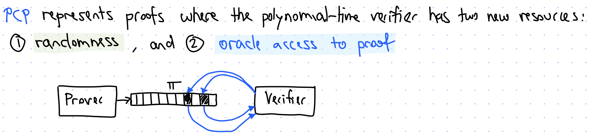

---

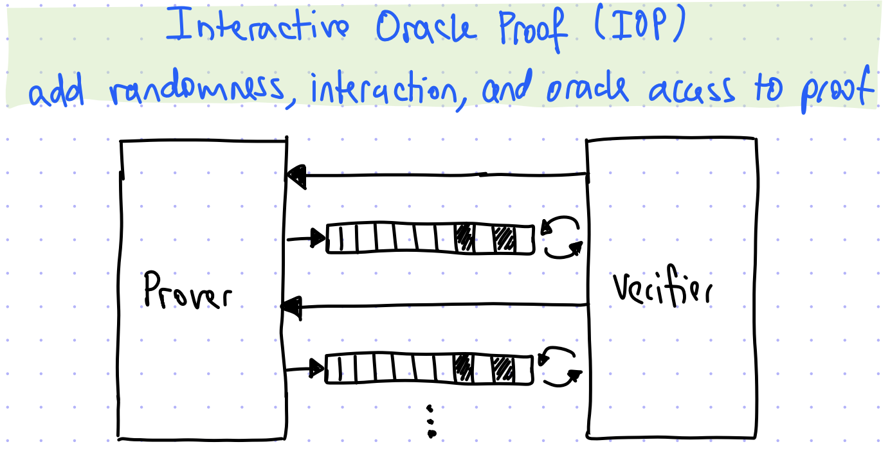

---

- $\mathcal{IP} = \mathcal{PSPACE}$
- $\mathcal{MIP} = \mathcal{NEXP}$
- $\mathcal{MIP}^* = \mathcal{RE}$
- $\mathbf{N P}=\mathbf{PCP}[\mathrm{O}(\log n), \mathrm{O}(1)]$
---
# What are *PZK/SZK/CZK/HVZK/WI/WH*

---
$\left\{\left\langle P, V^*\right\rangle(x)\right\}_{x \in L}$

$\sim$

$\left\{S^*(x)\right\}_{x \in L}$

---
- WI: don’t know which witness is used
$\begin{aligned} & \left\{\left\langle P\left(w_x^1\right), V^*(z)\right\rangle(x)\right\}_{x \in L, z \in\{0,1\}^*} \\ & \left\{\left\langle P\left(w_x^2\right), V^*(z)\right\rangle(x)\right\}_{x \in L, z \in\{0,1\}^*}\end{aligned}$

- WH: difficult to reverse the witness
$$
\operatorname{Pr}\left[\left\langle P\left(Y_n\right), V^*(z)\right\rangle\left(X_n\right) \in R_L\left(X_n\right)\right]<\frac{1}{p(n)}
$$

---
# What are *Argument/KS/SE/UC*

---
> **arguments** permit the existence of “proofs” of incorrect statements, so long as those “proofs” require exorbitant computational power to find

- i.g. soundness for computational bounded prover (**Computational soundness**)

---
## Knowledge Soundness (Proof of Knowledge)
- Not only the witness exist, but also I "know" it.

> The password of this account *exists*, but I did not know it.

- SE/UC

---
# What is *Non-Interactive*

- Not "No Interaction"
- consists of a single message from $\mathcal{P}$ to $\mathcal{V}$

- designated verifier/ publicly verifiable
- Fiat-Shamir Transformation: $c=H(\text{Trans})$
- public coin vs privite coin
- NIZK/ Signature

---
# What is *Succinctness*
## Reexecution vs Using a Proof

---

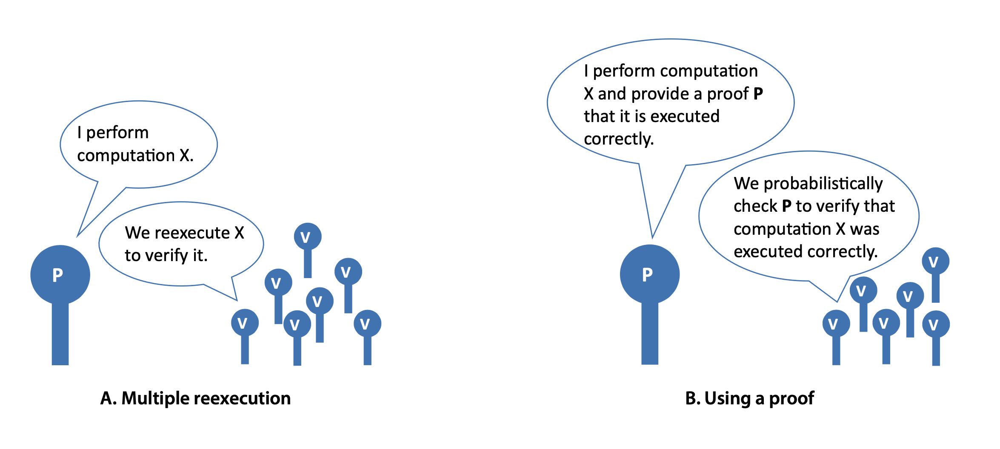

---

# What is *Trusted Setup/Ceremony*
- An algorithm that determines a protocol’s public parameters using information that must remain secret to ensure the protocol’s security. 
- Maybe a MPC protocol
- CRS model: no NIZK in plain model beyond $\mathcal{BPP}$
- Circuit-specific/Universal/Updated/Transparent
- Vitalik: [How do trusted setups work?](https://vitalik.ca/general/2022/03/14/trustedsetup.html)
- KZG Ceremony: https://ceremony.ethereum.org/

---
# What is *Polynomial Commitment*
- in the first phase, a Prover commits to a polynomial $p$ by emitting a public commitment; in the second phase the Verifier chooses a value $x$, and the Prover produces a value $y$ and convinces the Verifier that $y=p(x)$.
- KZG/IPA/FRI/Ligero/Brakedown/Orion...

---
# What is *Arithmetization*
- The process of turning *a generic statement or question* into *a set of equation* to be verified or solved.
> I am twice older than my youngest sibling

$$
x=2 * \min \left(a_1, a_2, \ldots, a_n\right)
$$

---

- Boolean Circuits/Arithmetic Circuits
- R1CS/QAP/Plonkish/AIR/CCS
- Front-end: Circom/Cairo/Noir/Leo…

---

# Some Examples
## 1. Coke Vs. Pepsi 

---

---

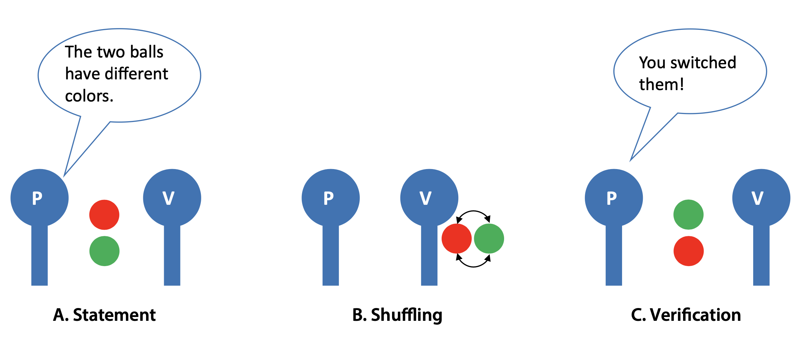

---
- Recall: Knowledge
- transfer of trust
- $\mathcal{coNP}$
- Soundness error $\epsilon_s=\frac{1}{2^n}$
- Private coin
- Designated verifier

---
## 2.Where's Waldo

---

---
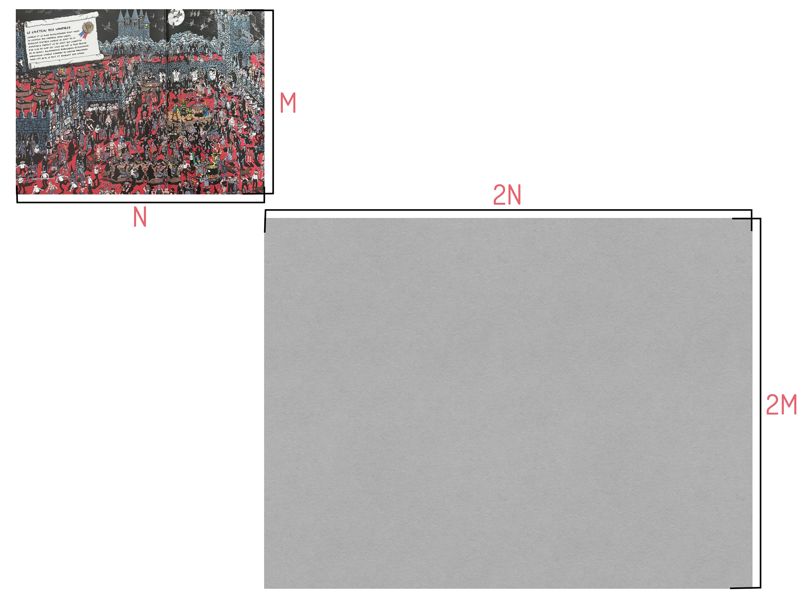

---
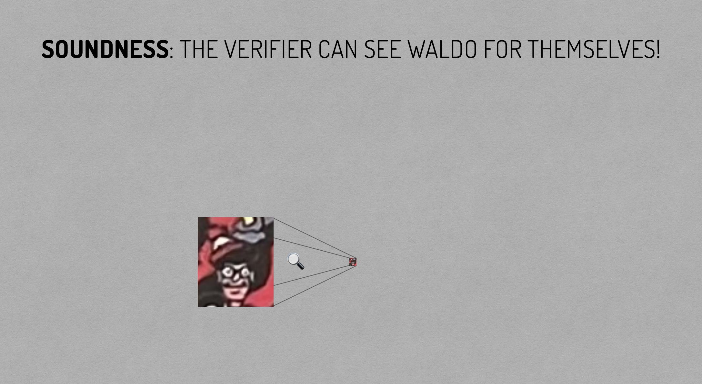

---
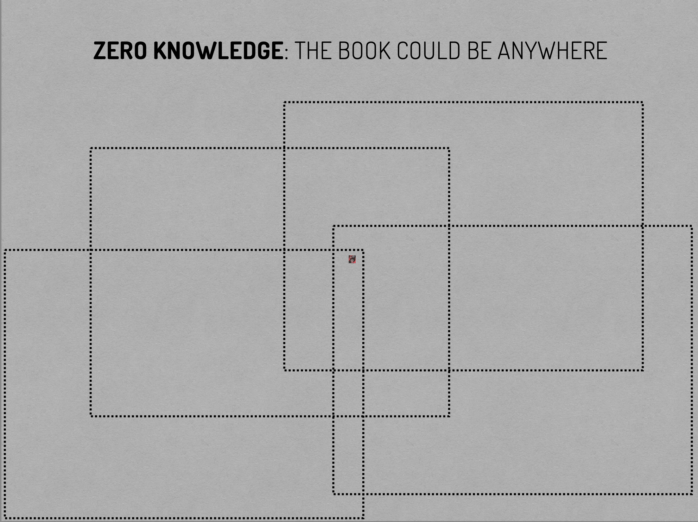

---

- non-interactive
- proof of knowledge
- ceremony
---

## Other Examples 
- Alibaba's Cave/Sudoku
- GI/QR/GNI/QNR/G3C/Hamilton/Schnorr

- [Oded Goldreich](https://www.wisdom.weizmann.ac.il/~oded/)

---
# Application of ZKP
- Blockchain(Rollups/zkEVM/Private Cryptocurrencies)
- [zkDocs](https://a16zcrypto.com/posts/article/zkdocs-zero-knowledge-information-sharing/): Zero-knowledge Information Sharing (Age > 18)
- [Zordle](https://github.com/nalinbhardwaj/zordle): ZK Wordle
- [Using ZK Proofs to Fight Disinformation](https://medium.com/@boneh/using-zk-proofs-to-fight-disinformation-17e7d57fe52f)
- [A zero-knowledge protocol for nuclear warhead verification](https://www.nature.com/articles/nature13457)

- Identification/Voting/PET/Copyright Protection etc.

---

# Thanks
(I hope this talk is NOT Zero-Knowledge for you :))

Kurt Pan’s Awesome Zero-Knowledge Proofs (2022): https://site.kurtpan.pro/ktpzkp22.html

